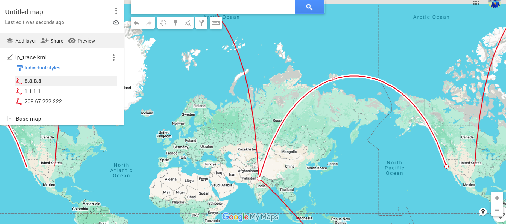

# IP-Trace-Visualizer
GeoLiteCity.Dat For Nginx form http://geolite.maxmind.com/download/geoip/database/GeoLiteCity.dat.gz

Now vista https://www.miyuru.lk/geoiplegacy # 🌍 IP Geolocation Trace – KML Visualization

This project visualizes IP connections from **Ghaziabad, India** to various international destinations using a `.kml` file that can be opened in **Google Earth**. It demonstrates how network traffic can be mapped geographically for security analysis or educational purposes.

## 📸 Preview

> Lines connect Ghaziabad to various IP endpoints across the globe.

## 📌 Features

- Visualizes IP routes on Google Earth
- Routes from Ghaziabad to:
  - `8.8.8.8` (Google DNS – USA)
  - `1.1.1.1` (Cloudflare – Australia)
  - `208.67.222.222` (OpenDNS – USA)
- Clean and interactive geospatial display using KML

## 📂 Files Included

- `ip_trace.kml` — KML file to load into Google Earth

## 🗺️ How to Use

1. Download `ip_trace.kml`
2. Open [Google Earth](https://earth.google.com/web/)
3. Drag and drop the file into the map
4. Explore connection paths from Ghaziabad to other global locations

## 🔧 Tools & Technologies

- KML (Keyhole Markup Language)
- Google Earth
- Optional tools: `dpkt`, `pygeoip` (for dynamic generation)

## 📜 License

Released under the MIT License.

